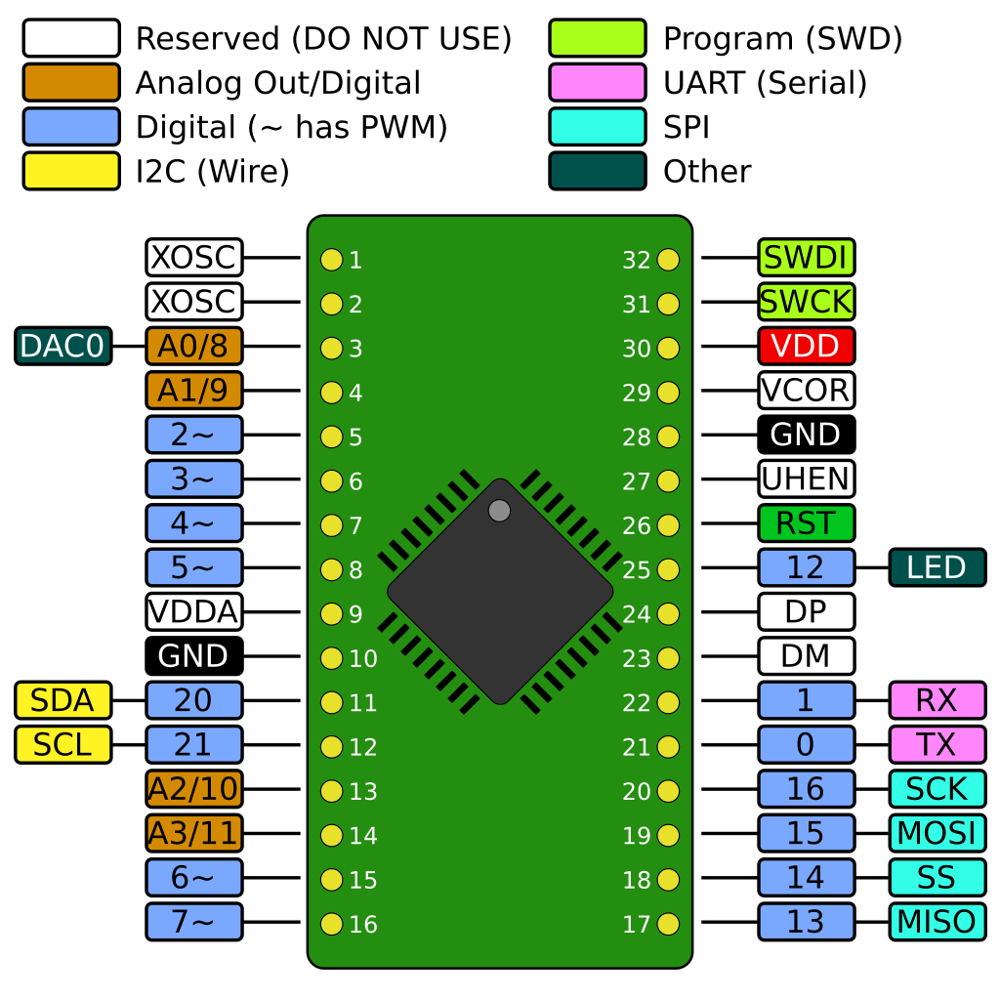

# BasicSAMDArduino
This project is for a simple custom Arduino board for ATSAMD21E1xA/B/C microcontrollers. These controllers are the 32 pin version of the
ATSAMDE21G18 used in the Arduino Zero. They come in a range of different Flash and RAM memory capacities but are otherwise the same. 

The 32 pin package has been chosen because adaptor boards for that form factor are easy to find and such microcontrollers, although SMD mounted, have pins which 
are still large enough that they can be hand soldered with a normal soldering iron and without a microscope.

# Hardware
All that is required for making this custom board is:
* The microcontroller itself, in a TQFP32 package (i.e. the -AU version). Any ATSAMD21E1xA/B/C-AU will work but the E14 might not have enough memory to be usefull with this Arduino core.
* 1 32-pin adaptor board for QFP32 chips with a pitch (distance between pins) of 0.8mm.
* 2 16-pin male pin headers (which can be cut from easy to find 40-pin ones)
* 1 1uF SMD 0604 ceramic capacitor. This size SMD capacitor is perfect to solder between two pins of the pin header.
* 1 0.1uF SMD 0604 or THT ceramic capacitor. The SMD one fits easily between header pins and thus reduces clutter but the THT one also fits on the board.
* 1 0.1uF THT ceramic capacitor (can't easilly use an SMD cap here as it connects two pins which are not adjacent)
* 2 10uF THT tantalum capacitors or 2 100uF THT electrolitic capacitors.
* 1 10uH THT inductor with a minimum current capacity of 200mA.

Please check the schematic in the KiCad project under "BasicCustomBoard-Hardware" for details of what to connect to what and where. In the same subdirectory there is also a picture of one of these boards made with a ATSAMD21E17A-AU which should give you an idea of one way to organise the components (please note that if available a smaller than used there inductor - about 0.2A suffices - can be used as the one on the picture is designed to carry a lot more current and hence is unnecessarily large).

The components used in this project are nothing more than those listed in the Schematic Checklist of the Datasheet for this microcontroller family.

Please note that these microcontrollers operate at 3.3V so you need to supply them with that. Thus to operate, for example, from the 5V supplied by USB, you have to regulate that down to 3.3V

Also note that these custom boards do not have USB (although it can be added and the Arduino variant configuration and software is ready for it) and hence programming has to be done via a programmer which supports the SWD protocol, for example a JLink programmer or a Blackmagic Probe (this latter one can be made from a bluepill board). On the upside as programming is done via a native protocol directly supported by the chip, no memory is used by a bootloader to support programming via USB emulating a Serial device.

# Software
At the moment, inside the "variants" subdirectory there is Arduino variant support for the ATSAMD21E15B (which has 32KB flash and 4KB SRAM), the ATSAMD21E16B (64KB flash and 8KB SRAM) and the ATSAMD21E17A (128KB flash and 16KB SRAM) but adding support for other microcontrollers of this family with the same number of pins is easy.

The pins are configured so that, besides the traditional Digital I/O pins and Analog pins, one of the Analog pins is also a DAC (i.e it supports Analog Out) and there are dedicated pins with Hardware support for each of I2C (aka TwoWire), SPI, and Serial communications. Also note that the pins for a 32k crystal oscilator and USB are reserved so a custom designed board (rather than one made using an adaptor board) which has either or both of them will work with this variant configuration by merely change some build parameters.

Below you can see the Arduino pin mapping for all versions of these ATSAMD21E (i.e. all using the 32 pins microcontroller) boards:

Reserved pins are for adding an external crystal oscilator, adding USB support and, in the case of "VCOR" nothing should be connected there as it's microcontroller's internally regulated power supply.

Please note that only support for using PlatformIO as IDE and build tool is present - the variant files themselves will also work with the Arduino IDE but the build configuration for this IDE is not provided (yet).

Included is a simple blink program using LED_BUILTIN which is mapped to the pin marked as LED in the diagram.

# TODO
* Arduino IDE configuration 

